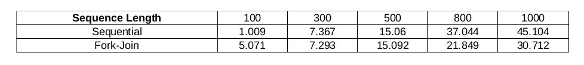
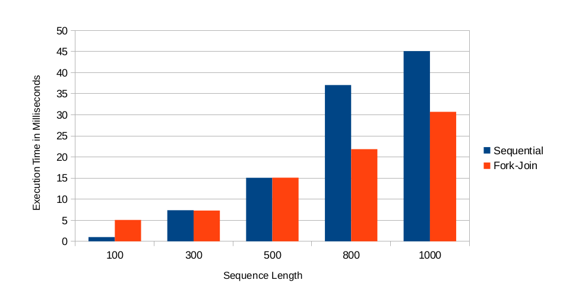
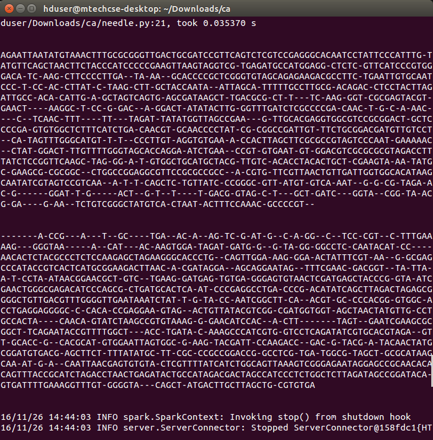

###### :rocket: my first hadoop project :rocket:
## Needleman-Wunsch Algorithm: Parallel Implementation of Needleman-Wunsch Algorithm using Hadoop-Spark and C
### A Parallel Implementation of Needleman-Wunsch Algorithm in Python using Apache Hadoop and Apache Spark. The same was implemented using C using different parallel techniques for the comparison.

* Technologies: C, Pthreads, Python, Apache Hadoop, Apache Spark
* Tools and OS: Atom, Ubuntu
* Platform: Hadoop Cluster
* Lines of Code: 607
* Month-Year: OCT-2016

### Comparison of Implementations in C

### Implementation in Python on Hadoop-Spark
# needleman-wunsch-hadoop-spark
